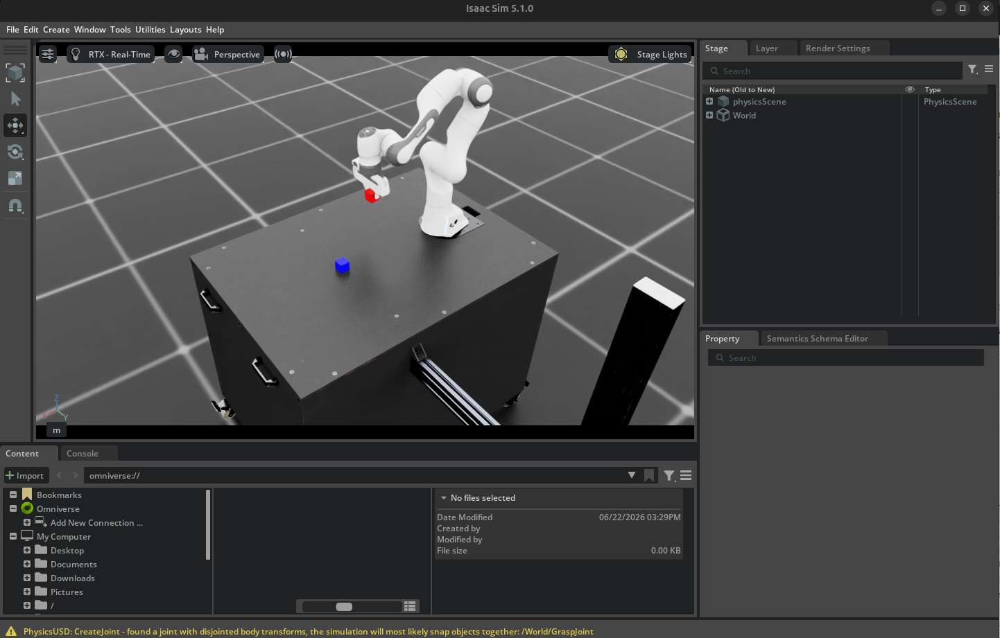
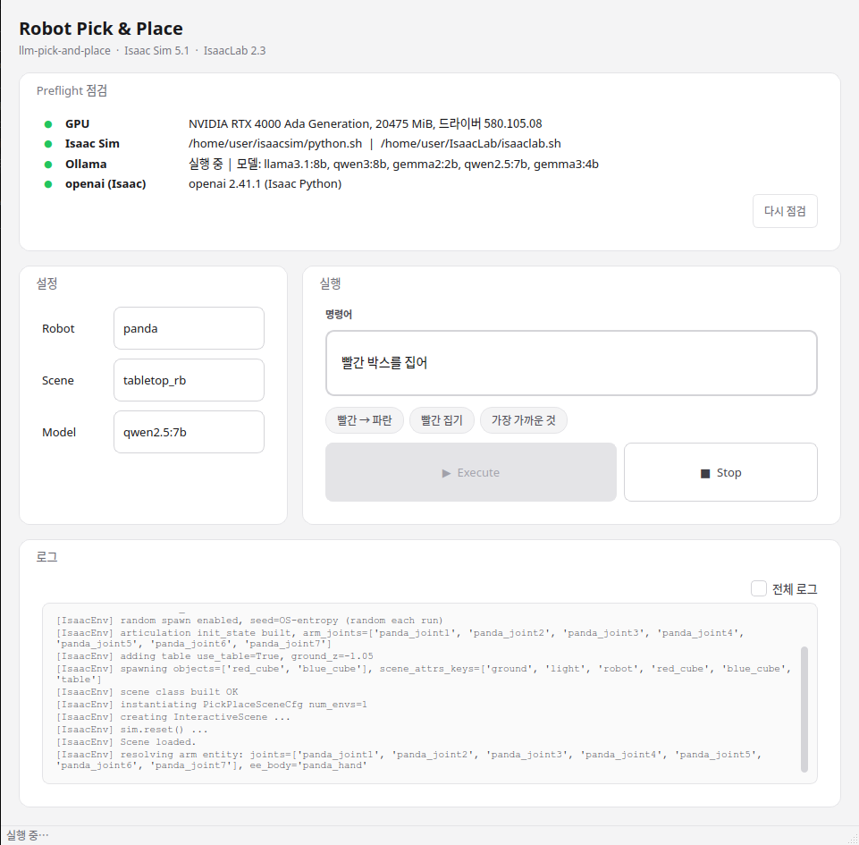

# llm-pick-and-place

🌐 **한국어** | [English](README.md)

**NVIDIA Isaac Sim 위의 Franka Panda를 자연어로 조작하는 pick-and-place 파이프라인 — LLM
tool-calling 에이전트가 구동합니다.**

*"빨간 큐브를 집어"* 나 *"빨간 큐브를 파란 큐브 위에 올려"* 같은 명령을 입력하면, 파이프라인이
장면을 인식하고 → LLM 에이전트가 기술(skill) 시퀀스를 계획하고 → 물리 시뮬레이션에서 실행하며,
실패하면 폐루프(closed-loop)로 재계획합니다.

코드베이스는 **contract-first**로 설계됐습니다. 모든 단계(Env / Perception / Planner /
Executor)는 [`contracts.py`](llm_manip/contracts.py)의 데이터클래스로만 통신하므로, 한 구현체를
나머지에 손대지 않고 교체할 수 있습니다. 전체 루프는 순수 파이썬 mock(GPU 불필요), 또는 실제 물리
Panda가 도는 Isaac Sim 양쪽에서 동작합니다.

---

## 데모

```bash
# Isaac Sim — LLM 에이전트가 계획, DiffIK가 실행, FixedJoint로 파지
"$ISAACSIM_PYTHON" scripts/run_sim.py \
  --robot panda --scene tabletop_rb --executor ik \
  --planner llm --instruction "pick up the red cube" --seed 0
# → ... success=True  re-plans=<n>
```



GPU가 없어도 — 전체 파이프라인이 mock 환경에서도 돌아갑니다:

```bash
python3 scripts/run.py --instruction "put the red cube on the blue cube"
# → success=True  re-plans=1     (첫 시도에서 내장된 미끄러짐이 재계획을 한 번 유발)
```

---

## 주요 특징

- **Contract-first 모듈 파이프라인** — `Env`, `Perception`, `Planner`, `Executor`는 파이썬
  Protocol이며 [factory](llm_manip/factory.py)가 조립합니다. 각각 독립적으로 교체 가능합니다.
- **LLM tool-calling 에이전트 플래너** — 플래너([`planner/llm.py`](llm_manip/planner/llm.py))는
  tool-calling 에이전트 루프를 돕니다(모델이 장면 조회 도구를 부른 뒤 `pick`/`place`를 호출).
  단계적 폴백을 갖춰요: tool-calling → 위치-프롬프트 JSON → rule-based. 계획을 반환하기 전에 모든
  단계의 스킬 이름과 물체 라벨을 실제 장면과 대조해 검증합니다.
- **Robot-agnostic 설계** — 로봇별 세부사항(관절 이름, EE 링크, 그리퍼 규약, TCP 오프셋, Isaac Lab
  CFG)은 전부 하나의 `RobotConfig`([`robots.py`](llm_manip/robots.py))에 모여 있습니다.
  **Franka Panda가 레퍼런스 구현**입니다.
- **Isaac Sim 5.1 / Isaac Lab 2.3.0 물리** — 하향 자세(downward) 제약을 둔 Differential IK
  포즈 제어와, 운동학적(kinematic) **FixedJoint** 파지(TCP 근접 + 그리퍼 닫힘 감지).
- **PySide6 데스크탑 런처** — preflight 점검(GPU / Isaac Sim / Ollama), 프리셋, 실시간 로그
  스트림을 갖춘 네이티브 Qt 앱. 런처 자체는 Isaac 모듈을 import하지 않습니다.
- **Ablation 평가 하니스** — [`scripts/eval.py`](scripts/eval.py)가 명령 난이도별
  (literal / synonym / colour-swap / spatial)로 플래너 출력을 정답 시퀀스와 대조해 채점합니다.
  시뮬레이션 불필요.

---

## 아키텍처

`Orchestrator.run(instruction)`이 perceive → plan → execute → re-plan 루프를 구동합니다.
인식이 날것 관측을 `WorldState`로 바꾸고, 플래너가 `SkillCall`들로 이루어진 `Plan`을 내고,
`SkillExecutor`가 각 스킬을 폐루프(`act → env.step → perceive`)로 실행합니다. 스킬이 실패하면
다시 인식·재계획하며, 최대 `--max-replans`회까지 반복합니다.

전체 데이터 흐름도, LLM 3-경로 폴백, pick/place 상태머신은
**[docs/architecture.md](docs/architecture.md)** 를 참고하세요.

**인터랙티브 다이어그램:** [docs/dataflow.html](docs/dataflow.html) (perceive → plan → execute
데이터 흐름), [docs/pick_algorithm.html](docs/pick_algorithm.html) (pick/place 상태머신) —
브라우저에서 직접 열거나 GitHub Pages로 보세요.

---

## 사용법

설치(Isaac Sim·Ollama 설정 포함 전체 가이드는 **[docs/INSTALL.md](docs/INSTALL.md)** 참조):

```bash
pip install -e .            # 코어 (numpy만)
pip install -e ".[llm]"     # OpenAI 호환 LLM 플래너
pip install -e ".[ui]"      # PySide6 런처
pip install -e ".[dev]"     # pytest
```

**Mock 러너** ([`scripts/run.py`](scripts/run.py)) — 전체 루프, Isaac 불필요:
```bash
python3 scripts/run.py \
  --instruction "put the red cube on the blue cube" \
  --robot panda --scene tabletop_rb \
  --planner rule_based            # rule_based | llm
# 로컬 Ollama 모델로 LLM 플래너 사용:
python3 scripts/run.py --planner llm --llm-backend ollama --model qwen2.5:7b \
  --instruction "put the red cube on the blue cube"
```

**Isaac Sim 러너** ([`scripts/run_sim.py`](scripts/run_sim.py)) — 물리 Panda:
```bash
"$ISAACSIM_PYTHON" scripts/run_sim.py \
  --robot panda --scene tabletop_rb \
  --executor ik --planner llm --grasp kinematic \
  --seed 0 --instruction "pick up the red cube"
```
옵션: `--executor {ik,mock}`, `--planner {rule_based,llm}`,
`--grasp {kinematic,physics}`, `--seed <int>`, 그리고 `--headless` 같은 Isaac Lab
AppLauncher 플래그.
> `run_sim.py`는 자기 자신을 Isaac Sim 번들 파이썬으로 다시 실행하며, 경로는
> `$ISAACSIM_PYTHON` → `$ISAACSIM_PATH/python.sh` → `~/isaacsim/python.sh` 순으로 찾습니다.

**데스크탑 런처** ([`scripts/launcher.py`](scripts/launcher.py)):
```bash
pip install -e ".[ui]"
bash run_app.sh                 # 또는: python3 scripts/launcher.py
```



**Ablation 평가** ([`scripts/eval.py`](scripts/eval.py)) — 플래너 정확도, sim 불필요:
```bash
python3 scripts/eval.py --planners rule_based llm:qwen2.5:7b --runs 3
# results/ablation.csv 생성
```

> rule-based 플래너는 `put/move/place/stack the <X> on/onto the <Y>` 형태만 파싱합니다.
> *"pick up the nearest cube"* 같은 자유형 명령은 LLM 플래너가 처리합니다.

테스트 실행:
```bash
pytest -q
```

---

## 프로젝트 구조

```
llm_manip/
├── contracts.py          # 공유 데이터클래스 (Pose, WorldState, Plan, Action, …)
├── robots.py             # RobotConfig + ROBOTS{panda} + ISAAC_SUPPORTED_ROBOTS
├── scenes.py             # SceneConfig + SCENES{tabletop_rb}
├── orchestrator.py       # perceive → plan → execute → re-plan 루프
├── factory.py            # 이름 → 구현체 빌더
├── env/
│   ├── base.py           # Env Protocol + RawObs
│   ├── mock_env.py       # 해석적 운동학 mock 환경
│   └── isaac_env.py      # Isaac Sim 환경 (DiffIK + FixedJoint 파지)
├── perception/
│   ├── base.py           # Perception Protocol
│   └── oracle.py         # GT 포즈 기반 인식 (상한 baseline)
├── planner/
│   ├── base.py           # Planner Protocol + SKILL_SCHEMA
│   ├── rule_based.py     # 정규식 키워드 플래너 (LLM 폴백 겸용)
│   └── llm.py            # LLM tool-calling 에이전트 플래너 (3-경로 폴백)
└── executor/
    ├── base.py           # Skill Protocol + SkillExecutor (폐루프)
    ├── mock_skills.py    # 해석적 pick/place/move_to
    └── ik_skill.py       # Isaac Sim DiffIK pick/place/move_to 상태머신
scripts/   run.py · run_sim.py · launcher.py · eval.py · generate_data.py
tests/     contracts · mock_loop · robots_scenes · llm_planner · isaac_integration
docs/      architecture.md · design.md · INSTALL.md
```

---

## 한계 (정직한 범위)

연구/포트폴리오용 파이프라인이며, 프로덕션 스택이 아닙니다:

- **인식은 oracle 전용** — `OraclePerception`은 GT(ground-truth) 물체 포즈를 사용합니다
  (`confidence=1.0`). 카메라/비전 기반 검출기는 없습니다.
- **실행에 충돌 회피·모션 플래닝 없음** — IK 실행기는 Differential IK(`ik_skill.py`)이며,
  관절 한계나 장애물 근처에서 수렴에 실패할 수 있습니다.
- **파지는 운동학적 FixedJoint** — 감지되면 USD FixedJoint가 물체를 그리퍼에 구속합니다.
  마찰 기반 `physics` 파지 모드도 있으나 검증되지 않았습니다.
- **로봇 1종, 씬 1종** — `ROBOTS`에는 `panda`만, `SCENES`에는 `tabletop_rb`(테이블 위
  red_cube + blue_cube, 무작위 스폰)만 등록돼 있습니다. 설계가 robot/scene-agnostic이라,
  추가는 코드 변경이 아니라 config 항목 추가입니다.

---

## 라이선스

MIT — [LICENSE](LICENSE) 참조.
