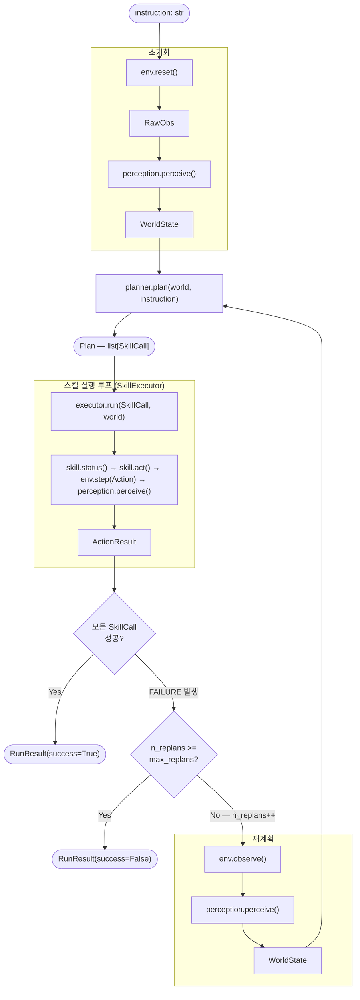
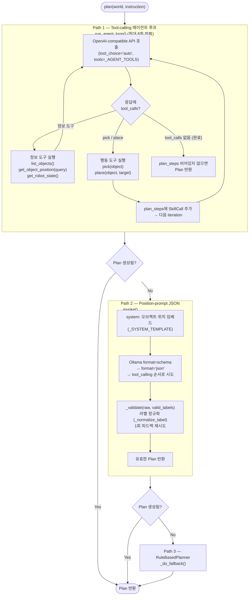

# llm-pick-and-place — 아키텍처 문서

## 개요

**llm-pick-and-place**은 자연어 명령("파란 박스를 빨간 박스 위에 올려")을 받아 로봇 팔이 실제 물체를 집고 놓는 pick-and-place를 수행하는 모듈식 파이프라인이다.
Isaac Sim 5.1 / IsaacLab 2.3.0 을 시뮬레이터 백엔드로 사용하며, 언어 이해는 Ollama·Anthropic OpenAI-호환 API로 연결된 LLM이 담당한다.

설계 철학은 **contract-first 모듈화**다. 모든 컴포넌트 경계(Env / Perception / Planner / Executor)는 `contracts.py`에 정의된 공통 자료형으로만 통신하며, Protocol 인터페이스를 구현하면 어떤 구현체든 교체·평가가 가능하다.

---

## 자료형(계약)

`llm_manip/contracts.py`에 정의된 불변 자료구조다. 모든 모듈은 이 타입만을 통해 통신하며, 개별 모듈은 상대방의 내부 구현을 알지 못한다.

| 타입 | 필드 | 역할 |
|---|---|---|
| `Pose` | `position: np.ndarray(3,)` · `quaternion: np.ndarray(4,)` | 3D 위치+자세. `from_xyz(x,y,z)` 팩토리 제공 (quaternion은 항등) |
| `ObjectState` | `id: str` · `label: str` · `pose: Pose` · `confidence: float` · `bbox: Optional[tuple]` | 씬의 물체 하나 |
| `RobotState` | `joint_positions: np.ndarray(n,)` · `ee_pose: Pose` · `gripper: float` · `holding: Optional[str]` | 로봇의 현재 상태; `holding`은 파지 중인 object id |
| `WorldState` | `t: int` · `objects: list[ObjectState]` · `robot: RobotState` · `find(label) → Optional[ObjectState]` | Perception이 생성하는 전체 씬 스냅샷 |
| `SkillCall` | `skill: str` · `args: dict` | Planner가 내보내는 단일 기술 호출 (예: `pick {"label":"red_cube"}`) |
| `Plan` | `steps: list[SkillCall]` | Planner가 반환하는 실행 순서 |
| `SkillStatus` | enum: `RUNNING` · `SUCCESS` · `FAILURE` | 기술의 현재 실행 상태 |
| `ActionResult` | `status: SkillStatus` · `message: str` · `world_after: WorldState` | Executor가 반환하는 한 스킬의 결과 |
| `Action` | `joint_targets: np.ndarray(n,)` · `gripper: float` · `ee_target: Optional[Pose]` | Skill이 환경에 보내는 단일 제어 명령; `ee_target`이 있으면 IsaacEnv가 DiffIK로 구동 |

데이터 변환 방향:

```
instruction: str
  → WorldState  (Perception)
  → Plan        (Planner)
  → Action      (Skill.act)
  → ActionResult (Executor/Env)
```

---

## 모듈 맵

| 파일 경로 | 역할 | 핵심 심볼 | 입력 → 출력 |
|---|---|---|---|
| `llm_manip/contracts.py` | 전체 자료형 정의 | `WorldState` · `Plan` · `Action` · `ActionResult` | — (공유 타입) |
| `llm_manip/orchestrator.py` | perceive→plan→execute→re-plan 루프 | `Orchestrator.run()` · `RunResult` | `instruction: str` → `RunResult` |
| `llm_manip/factory.py` | 구현체 조립 팩토리 | `build_env` · `build_perception` · `build_planner` · `build_skills` | 이름 문자열 → 인스턴스 |
| `llm_manip/robots.py` | 로봇별 정적 설정 | `RobotConfig` · `ROBOTS` · `ISAAC_SUPPORTED_ROBOTS` · `get_robot()` | — |
| `llm_manip/scenes.py` | 씬별 정적 설정 | `SceneConfig` · `SCENES` · `get_scene()` | — |
| `llm_manip/env/base.py` | Env Protocol + RawObs | `Env` (Protocol) · `RawObs` | `Action` → `RawObs` |
| `llm_manip/env/mock_env.py` | 해석적 운동학 모의 환경 | `MockEnv` | `Action` → `RawObs` |
| `llm_manip/env/isaac_env.py` | Isaac Sim 물리 시뮬레이터 환경 | `IsaacEnv` (DiffIK, FixedJoint grasp) | `Action` → `RawObs` |
| `llm_manip/perception/base.py` | Perception Protocol | `Perception` (Protocol) | `RawObs` → `WorldState` |
| `llm_manip/perception/oracle.py` | GT 포즈 직접 사용 | `OraclePerception.perceive()` | `RawObs` → `WorldState` |
| `llm_manip/planner/base.py` | Planner Protocol + 스킬 어휘 | `Planner` (Protocol) · `SKILL_SCHEMA` | `WorldState` → `Plan` |
| `llm_manip/planner/rule_based.py` | 정규식 기반 플래너 | `RuleBasedPlanner.plan()` | `(WorldState, str)` → `Plan` |
| `llm_manip/planner/llm.py` | LLM 에이전트 플래너 (3단계 폴백) | `LlmPlanner.plan()` · `_run_agent_loop()` · `_invoke()` | `(WorldState, str)` → `Plan` |
| `llm_manip/executor/base.py` | Skill Protocol + SkillExecutor | `Skill` (Protocol) · `SkillExecutor.run()` | `(SkillCall, WorldState)` → `ActionResult` |
| `llm_manip/executor/mock_skills.py` | 모의 스킬 (물리 없음) | `MOCK_SKILLS` (`pick`/`place`/`move_to`) | `WorldState` → `Action` |
| `llm_manip/executor/ik_skill.py` | Isaac Sim용 DiffIK 스킬 | `IK_SKILLS` · `configure()` · `PickSkill` · `PlaceSkill` · `MoveToSkill` | `WorldState` → `Action` |
| `scripts/run_sim.py` | Isaac Sim 진입점 (AppLauncher 선행) | `main()` | CLI args → `RunResult` |
| `scripts/run.py` | 모의 환경 전용 CLI 러너 | `main()` | CLI args → `RunResult` |
| `scripts/launcher.py` | PySide6 데스크탑 GUI | `LauncherWindow` · `_do_execute()` | subprocess → 로그 스트림 |
| `scripts/eval.py` | 플래너 정확도 ablation | `EVAL_CASES` · `_run_one()` | 플래너 명세 → CSV |

---

## 메인 데이터 흐름

`Orchestrator.run()` (파일: `llm_manip/orchestrator.py`)의 perceive → plan → execute → re-plan 루프.



`SkillExecutor.run()` 내부(파일: `llm_manip/executor/base.py`)는 별도의 tight loop를 돌린다: `status() → RUNNING`이면 `act()` → `env.step(Action)` → `perception.perceive()` → 반복. `SUCCESS` 또는 `FAILURE`가 되면 `ActionResult`를 반환한다.

---

## LlmPlanner 내부 — 에이전트 루프와 3단계 폴백

파일: `llm_manip/planner/llm.py`



**주요 세부사항:**

- **정보 도구** (`list_objects`, `get_object_position`, `get_robot_state`): `WorldState`를 조회해 JSON 문자열로 반환. `get_object_position`은 자유형 질의("nearest cube")도 `_normalize_label()`로 정규화.
- **행동 도구** (`pick`, `place`): API를 호출하지 않고 `plan_steps: list[SkillCall]`에 추가만 한다. 에이전트 루프가 끝날 때 `Plan(steps=plan_steps)`로 포장.
- **한국어 지원**: `_KR_MAP`(예: `빨간→red`, `박스→cube`)으로 토큰 치환 후 라벨 매칭.
- **`strict_llm=True`**: 폴백 대신 `RuntimeError`를 raise. `eval.py`에서 순수 LLM 성능 측정 시 사용.
- **`_invoke()` 3-sub-path**: Ollama `format=schema` → `format="json"` → OpenAI tool-calling 순서로 시도해 모델 버전 호환성 확보.

---

## 스킬 상태 머신 (IK 모드)

파일: `llm_manip/executor/ik_skill.py` — Isaac Sim 전용. `configure(tcp_offset_z, obj_half_h)`로 로봇·씬별 상수를 런타임에 주입.

**PickSkill** (pick-and-lift):
```
APPROACH → DESCEND → CLOSE (50 step 대기) → WAIT_GRASP → LIFT → SUCCESS
```
- `APPROACH→DESCEND` 전환 시 관측된 큐브 Z에서 `grasp_wrist_z = cube_z + tcp_offset_z`를 동적 계산 (씬 원점 높이에 독립적).
- `_TOL_FINE = 0.010 m` — wrist가 목표 10 mm 이내일 때 CLOSE 진입.

**PlaceSkill** (내려놓기):
```
HOVER → DESCEND → OPEN (20 step 대기) → WAIT_RELEASE → RETREAT → SUCCESS
```

**MoveToSkill**: EE를 대상 오브젝트 위 `_EE_APPROACH_Z`(0.40 m)로 이동.

Mock 모드(`executor/mock_skills.py`)의 동일 이름 스킬은 joint_targets[:3]을 EE xyz로 직접 사용하는 해석적 운동학이며 물리 시뮬레이션 없음.

---

## 로봇 비종속 설계

파일: `llm_manip/robots.py`

`RobotConfig` 데이터클래스가 로봇 한 종류의 모든 정적 파라미터를 담는다. 환경(`IsaacEnv`)과 스킬(`ik_skill.configure()`)은 이 객체만 참조해 하드코딩이 없다.

**`RobotConfig` 주요 필드:**

| 필드 | 설명 |
|---|---|
| `reach` | 작업 반경 (m) |
| `usd_path` | Isaac Nucleus USD 에셋 경로 |
| `tcp_offset_z` | wrist 기준점→손끝 거리 (m). Panda: 0.107 |
| `isaaclab_module` / `isaaclab_cfg` | Isaac Lab `ArticulationCfg` 심볼 위치. `None`이면 Isaac Sim 미지원 |
| `arm_joint_names` | `SceneEntityCfg`·홈포즈 딕셔너리 구성용 관절 이름 목록 |
| `gripper_joint_names` / `open_pos` / `close_pos` / `close_sign` | 그리퍼 관절 이름과 오픈/클로즈 값. Panda는 `close_sign=+1` (조인트가 0.04→0.0으로 감소) |
| `min_grasp_finger` | 파지 감지 임계값 (닫힌 양) |
| `gripper_attach_prim` | FixedJoint Body0 연결 프림 경로 |
| `grasp_dist_thresh` | TCP-물체 거리 파지 감지 임계값 (m) |

**`ROBOTS` 딕셔너리 등록 현황:**

| 키 | 모델 | `isaaclab_cfg` | Isaac Sim 사용 가능 |
|---|---|---|---|
| `panda` | Franka Panda | `FRANKA_PANDA_HIGH_PD_CFG` | ✓ |

`ISAAC_SUPPORTED_ROBOTS = frozenset(name for name, cfg in ROBOTS.items() if cfg.isaaclab_cfg is not None)` → `{"panda"}`.

`IsaacEnv.__init__`은 `isaaclab_cfg`가 비어 있으면(`None`) 즉시 `RuntimeError`를 raise해 미지원 로봇을 조기 차단한다 (현재 등록 로봇은 모두 CFG를 가지므로 도달 불가한 방어 가드).

**새 로봇 추가 방법**: `ROBOTS`에 `RobotConfig` 엔트리 하나 추가 + `isaaclab_cfg` 채우기. Orchestrator·Planner·Executor 코드 수정 불필요.

---

## 실행 진입점

**Isaac Sim 실사 실행** (`scripts/run_sim.py`):

AppLauncher를 argparse 이전에 생성해야 하는 Isaac Sim 제약을 처리한다. Isaac Lab Python 환경이 아니면 `/home/user/isaacsim/python.sh`로 자동 re-exec. 주요 인자: `--robot`, `--scene`, `--seed`, `--planner [rule_based|llm]`, `--executor [ik|mock]`, `--grasp [kinematic|physics]`, `--strict-llm`.

**모의 환경 실행** (`scripts/run.py`):

Isaac 없이 `MockEnv + MOCK_SKILLS`로 파이프라인 전체를 검증. `--planner [rule_based|llm]`·`--executor mock` 지원.

**GUI 런처** (`scripts/launcher.py`):

PySide6 네이티브 앱. `run_sim.py`를 `subprocess.Popen`으로 호출하며 Isaac/Omni 모듈을 직접 import하지 않는다. 플래너는 `llm` 고정. `OllamaWorker` 쓰레드가 `http://localhost:11434/api/tags`를 폴링해 Model 드롭다운을 채운다. `OLLAMA_MODEL` 환경변수로 선택 모델을 `run_sim.py`에 전달.

**Ablation 평가** (`scripts/eval.py`):

시뮬레이션 없이 플래너 정확도만 평가. `EVAL_CASES` 목록(literal / synonym / colour_swap / spatial 4종)으로 `planner.plan(world, instruction)`의 출력을 ground-truth `list[SkillCall]`과 비교. `--planners rule_based llm:qwen2.5:7b` 형태로 비교표와 CSV 생성. LLM 평가 시 `strict_llm=True`로 폴백 없이 원시 LLM 정확도 측정.

---

## 현재 한계

| 항목 | 현황 |
|---|---|
| Perception | `OraclePerception`만 구현됨. GT 포즈(`raw.gt_objects`)를 직접 사용해 완벽 정확도 (confidence=1.0). 실카메라 기반 인식 없음. |
| Executor | DiffIK 기반 (`ik_skill.py`). 충돌 회피·경로계획 없음. 장애물·관절 한계 위반 시 수렴 실패 가능. |
| Grasp 모드 | `kinematic`(기본): FixedJoint로 물체를 wrist에 구속. `physics`(미완성): `_apply_physics_friction()`으로 고마찰 재질 적용하나 실용성 미검증. |
| 씬 | `tabletop_rb` 하나만 등록됨 (red_cube + blue_cube, SeattleLabTable, random spawn). |
| 로봇 | `panda` 하나만 등록됨 (Franka Panda + parallel gripper). |
| 제거된 스텁 | `YoloPerception`, `CuroboSkill`, `MoveitSkill`이 초기 설계에 있었으나 미구현으로 판단해 제거됨. `pyproject.toml`의 `perception`·`curobo` 선택 의존성도 함께 제거. |

---

## 확인 필요

코드에서 직접 읽었으나 실행 환경 의존적이라 문서 기술 시 추측이 개입된 부분:

1. **`IsaacEnv`의 DiffIK 내부 구현**: `isaac_env.py`에서 `DifferentialIKController` 사용을 확인했으나, 정확한 컨트롤러 파라미터(스텝 크기·댐핑 계수)는 IsaacLab 버전별로 다를 수 있음. 문서에 "DiffIK 기반"으로만 기술.
2. **`physics` grasp 모드**: `_apply_physics_friction()` 코드는 존재하나 실제 파지 성공률이 검증되지 않아 "미완성"으로 기술.
